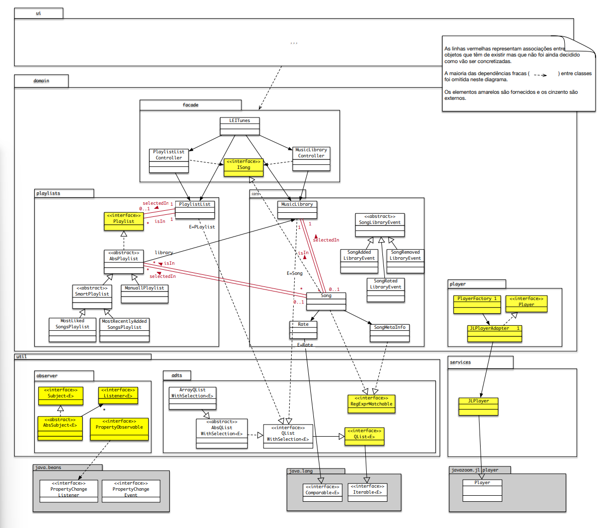

# LeiTunes

This project was a collaborative effort with a colleague for our ```Object-oriented Development``` subject.

The project focuses on an application that serves as a manager and player for digital music. The application was developed incrementally and iteratively. The initial increment concentrates on basic functionalities and music in the mp3 format, while the first iteration encompasses a fundamental set of use cases related to music libraries and playlists.

Very briefly, the application allow the users to upload songs to a library, select and play individual songs from the library, and perform searches. There are predefined smart playlists (automatically managed music lists), but users can also create playlists manually, and also it is possible to manage the songs within a manual playlist and play the songs from any playlist.

---
## Implementation

The project was implemented in ```Java with version 17.0.4.1.```

In the image below, the classes highlighted in yellow were provided, and we needed to implement the others and make decisions about their implementation, which are summarized in a ```Decision.pdf``` file.



In this project, we applied several concepts of ```good practices in Object-Oriented Development```, such as design patterns, to make our implementation more flexible and oriented towards change. We also focused on Information Hiding, Low Granularity Representation, High Cohesion, GRASP principles, and Behavioral Subtyping. Additionally, we implemented ```JUnit tests``` for some classes, achieving perfect coverage.

The project also utilized an open-source library, ```mp3agic``` (https://github.com/mpatric/mp3agic), to support ```MP3 files```. It has also implemented a ```Java Module``` for Information Hiding, modularity, encapsulation, and avoiding Jar Hell issues.

With this project we improved our proficiency in Object-Oriented Development, making use of several good practices as mentioned earlier. We learned how to make informed decisions around a large project's structure and manage dependencies, all to create a ```flexible codebase that is easy to change and minimazing dependencies while emphasizing encapsulation```.

All functionalities were successfully implemented, resulting in a ```very high score```.

---
## Running

The client module was provided, there are two clases:
- A ```Graphic interface (GUIClient)``` that supports some of the covered functionalities, including viewing the library's content, existing playlists, and playing a song from the library or a playlist.
- A ```client program (SimpleClient)``` that exercises some of the application's features, like an exemple of use.

Both options are available, and you can choose which one to use.

Because this is an Eclipse project you can run this locally in the IDE, and this will compile automatically with all the dependencies escepicied on the modules.

Since this is an ```Eclipse project```, you can ```run it locally within the IDE```, and it will automatically compile with all the specified dependencies, including the modules.